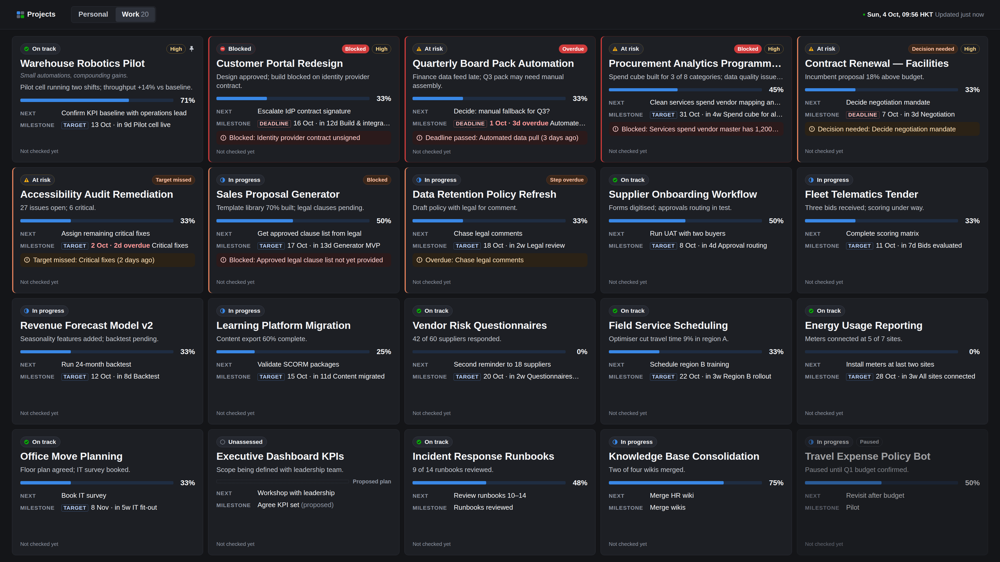

# Private project dashboard

A private, live dashboard of your projects, designed for a 4K projector and also usable on laptops and phones. It runs on **Cloudflare Workers + D1**, sign-in is through **Cloudflare Access**, and an hourly job checks project sources and builds a 07:00 Hong Kong daily summary.


*(Screenshot uses synthetic test projects.)*

## What it does

- **Two separate tabs, Personal and Work.**
  - Personal is visible only to you and the people in `PERSONAL_ALLOWED_EMAILS` (Renata).
  - Work is visible to people you invite. They're view-only by default, and edit access is granted separately.
  - Each project has an owner-only **Only me** switch that hides it from everyone else everywhere: tiles, counts, map, search, summaries, direct links, API, MCP.
- **Tiles** show:
  - name and an inspirational phrase;
  - a status chip (icon + label) with a concise update;
  - a milestone-based progress bar;
  - the most important next action;
  - the next milestone with a labelled **Deadline / Target / Suggested** date;
  - the top blocker or flag, and the priority;
  - last checked time and source freshness.
- **Order:** pinned → needs my action (overdue / blocked / decisions) → upcoming milestones → others → paused. Completed and archived projects live in a reopenable **Archive**.
- **Detail view** has:
  - full status and recent changes;
  - milestones with completion evidence and sub-steps;
  - next steps;
  - actual blockers vs anticipated risks vs tips;
  - sources with honest connection states;
  - dependencies and update history;
  - editing and manual-override controls, where permitted.
- **Projector mode** hides editing controls, fits up to about 20 tiles on one screen, and auto-refreshes when data changes. There's also an optional **relationship map** per tab, showing recorded dependencies only.
- **Hourly updates**, even with every browser closed:
  - connected sources are checked and changes summarised by Claude;
  - updates are applied only where backed by verbatim quotes;
  - manual overrides are respected, and confirmed deadlines are never moved;
  - "checked, no changes" is shown honestly, and the history is reviewable.
- **Natural-language changes** come from the **Ask** box, the REST API or the **MCP** endpoint (e.g. Claude Code). Each runs with the requesting person's permissions.
- **Daily summary at 07:00 Asia/Hong_Kong**, in the app and optionally by email (Resend). Each person's summary contains only what they may see.

## Documents

- **[docs/SETUP.md](docs/SETUP.md)** — deploy to Cloudflare, configure Access, invite people, import the initial project, costs.
- **[docs/ARCHITECTURE.md](docs/ARCHITECTURE.md)** — design, source-of-truth choice, security model, progress and date rules, update pipeline.
- **[docs/ASSISTANTS.md](docs/ASSISTANTS.md)** — which assistant connections are supported and how to connect Claude Code.
- **[docs/VERIFICATION.md](docs/VERIFICATION.md)** — what was tested, and what is functional vs not yet connected.

## Quick start (local)

```bash
npm install
SEED=synthetic npm run dev      # → http://localhost:8787/__dev/login (synthetic data, local only)
npm run check                   # typecheck + tests + browser tests
```

Deploy with `npm run setup:cloudflare`, then follow docs/SETUP.md.

## Initial project

`data/initial-projects.json` holds the initial Work project, built only from a dated snapshot of its ChatGPT Page. It is kept out of git while this repository is public; see `.gitignore`.
- The ChatGPT link is kept as a reference; the app cannot read it.
- Milestones are a proposal you confirm. Until then progress shows as *Unassessed*.
- No deadline, approval or percentage has been invented.

Import it via **Settings → Import JSON** after your first sign-in.

## Layout

```
src/server/   Worker: app.ts (routes), auth/, repo.ts, ops.ts, domain/, updater/, summary.ts, assistant/
src/client/   Preact UI (tiles, detail, projector, map, summary, settings)
src/shared/   types shared by server and client
migrations/   D1 schema
dev/          local Node server + local Access stand-in (development only)
tests/ e2e/   vitest + Playwright
data/         initial project import file
```
